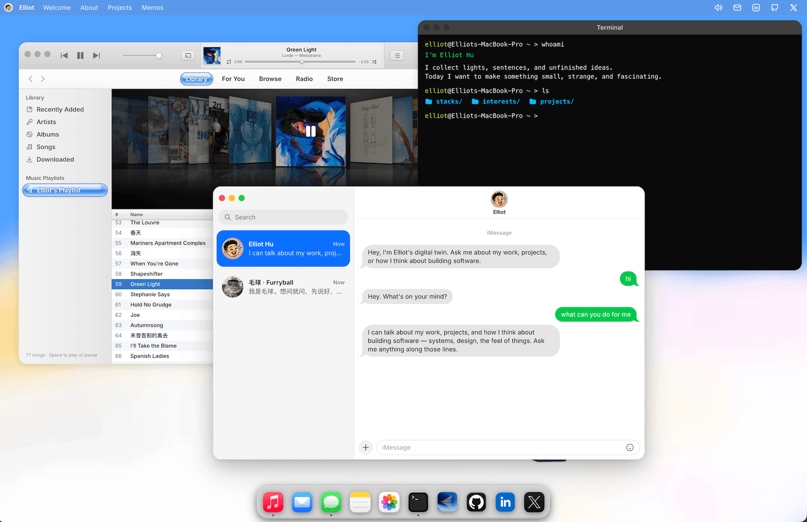
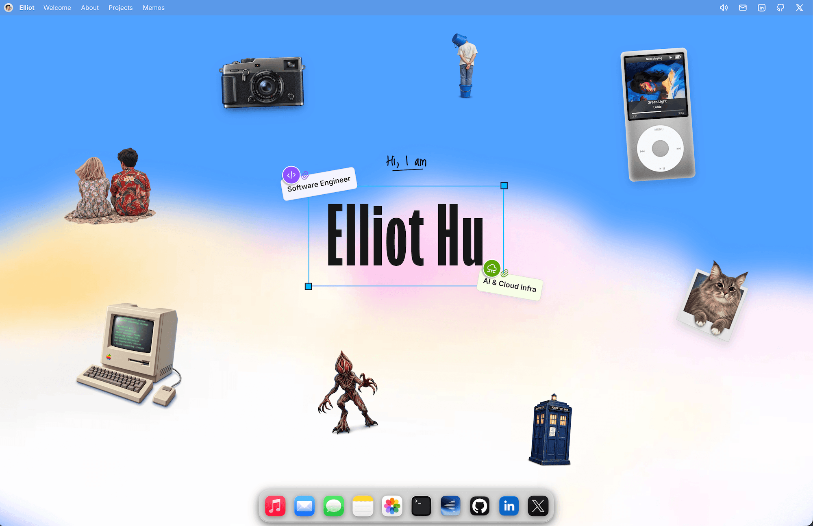
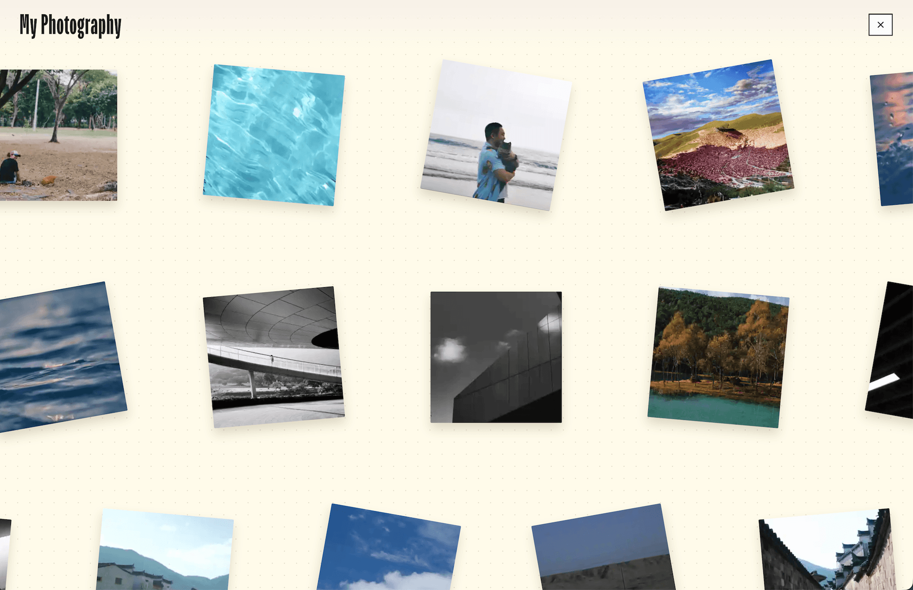
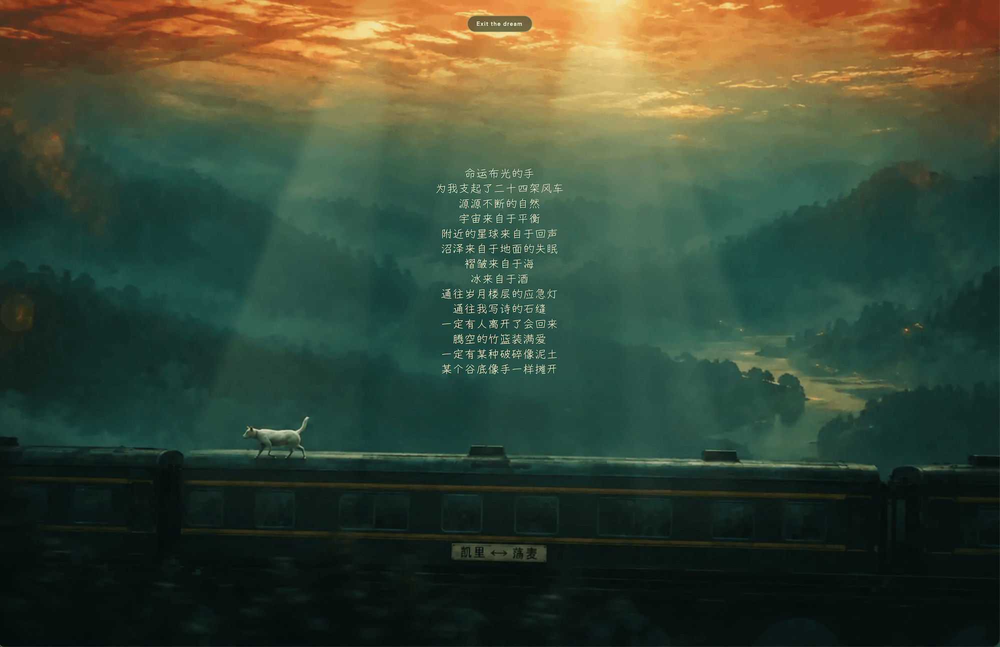
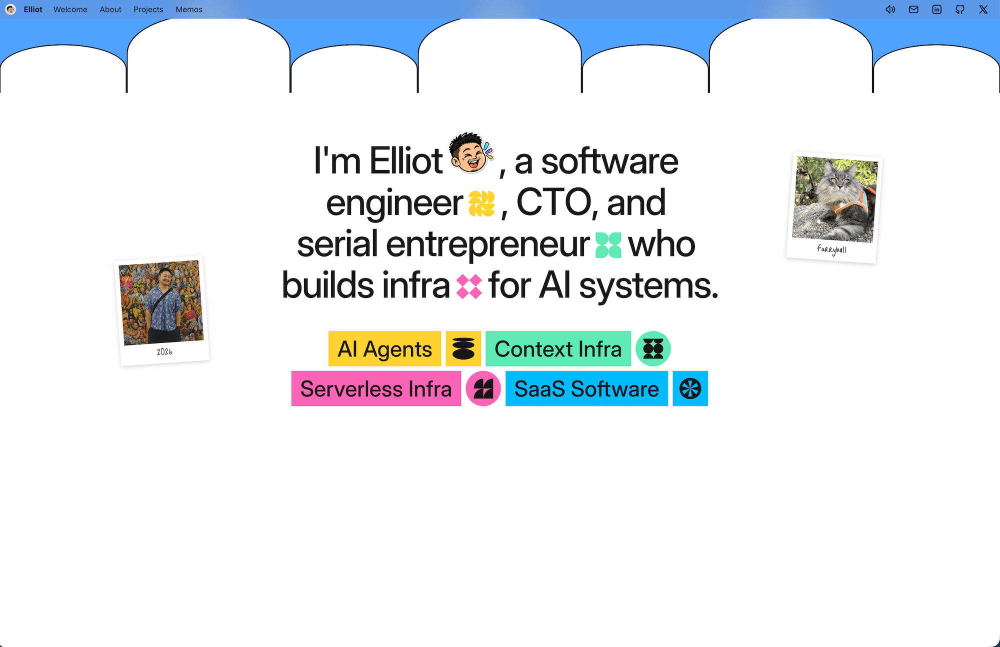
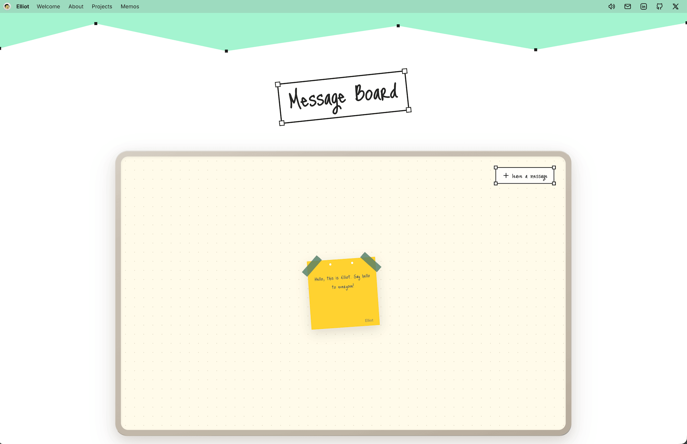
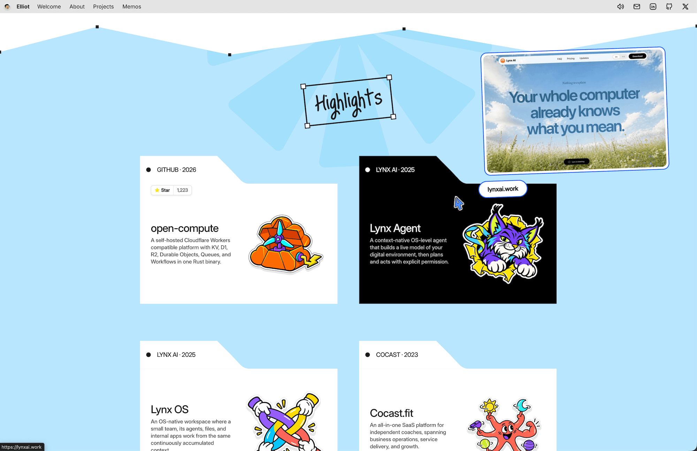

# Elliot Hu's Personal Site

An interactive, desktop-inspired portfolio built with TanStack Start and deployed on Cloudflare.

**Website:** [elliothu.me](https://elliothu.me)

The website source is maintained privately. This repository contains its public overview and CMS deployment configuration.

## Preview

<p>
  &nbsp;&nbsp;
  
</p>
<p>
  &nbsp;&nbsp;
  
</p>
<p>
  &nbsp;&nbsp;
  
</p>
<p>
  
</p>

## Architecture

- **Application:** React 19 and TanStack Start/Router provide the client UI, routing, SSR, and server functions.
- **Desktop shell:** Jotai atoms and a reducer manage windows, focus, stacking, snapping, and viewport state. Apps are defined in a registry and loaded on demand into reusable window frames.
- **Experience layer:** Tailwind CSS handles styling, Motion handles transitions and gestures, and PixiJS powers the richer canvas scenes.
- **Backend:** Cloudflare Workers hosts the application. D1 stores message-board entries, KV stores AI persona prompts, and Workers AI powers the Messages app behind a rate limiter.
- **Assets:** Static media is served from the site and its Cloudflare-backed asset domain.

## CMS

```bash
bun install
bun run cms:dev
bun run cms:deploy
```
